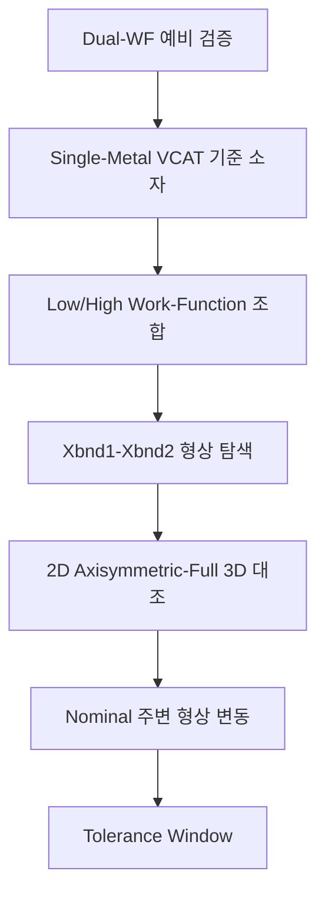
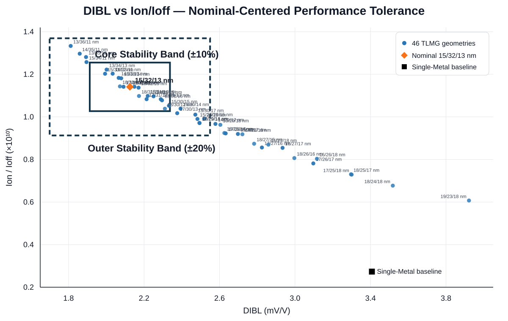
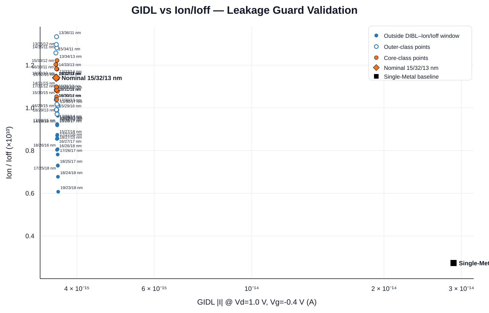

# Three-Layer Metal-Gate VCAT

## 프로젝트 개요 분석

**TCAD-Based Design Validation and Process Robustness Analysis of a Vertical-Channel Transistor with a Three-Layer Metal Gate**

고집적 DRAM의 4F² 구조를 위한 수직채널 트랜지스터(VCAT)를 대상으로, **Low–High–Low(L-H-L) Three-Layer Work-Function Gate**를 단계적으로 설계·검증하고 게이트 분할 경계의 형상 변동에 대한 **device-level tolerance window**를 분석한 공동 연구입니다.

본 연구는 Three-Layer WF gate 구조 자체를 새롭게 제안하는 것이 아니라, 선행 연구에서 제시된 L-H-L 구조를 기준으로 **일함수 조합 선정 → 게이트 구간 형상 탐색 → 2D/3D 비교 → 경계 변동 검증**을 수행하여 실제 설계에서 사용할 수 있는 nominal geometry와 허용 범위를 정량화하는 데 초점을 두었습니다.

**Summary:**  
This collaborative study uses Synopsys Sentaurus TCAD to validate a three-layer low–high–low work-function VCAT, select a balanced nominal geometry, compare 2D axisymmetric and full-3D results, and quantify a device-level gate-segmentation tolerance window around the nominal design.

## SMG–TLMG 정량 성능 비교

| Metric | SMG baseline | TLMG nominal | 변화 |
|---|---:|---:|---:|
| Ion | 8.476 × 10⁻⁶ A | 1.047 × 10⁻⁵ A | +23.57% |
| Ioff | 3.101 × 10⁻¹⁵ A | 9.180 × 10⁻¹⁶ A | −70.40% |
| Ion/Ioff | 2.733 × 10⁹ | 1.141 × 10¹⁰ | +317.45% |
| SS | 60.046 mV/dec | 60.028 mV/dec | −0.03% |
| DIBL | 3.407 mV/V | 2.125 mV/V | −37.63% |
| GIDL | 2.879 × 10⁻¹⁴ A | 3.590 × 10⁻¹⁵ A | −87.53% |

| Item | Description |
|---|---|
| Device | Vertical-Channel Access Transistor (VCAT) for DRAM |
| Gate concept | Three-Layer Work-Function Gate, Low–High–Low |
| Metal stack | Ti / TiN / Ti = 4.33 / 4.70 / 4.33 eV |
| TCAD | Synopsys Sentaurus SDE / SDevice |
| Main variables | Xbnd1, Xbnd2 |
| Nominal geometry | Xbnd1 / Xbnd2 = 35 / 67 nm |
| Gate segmentation | M1 / M2 / M3 = 15 / 32 / 13 nm |
| Main metrics | DIBL, Ion, Ioff, Ion/Ioff, SS, GIDL |
| Robustness study | 46 geometries, 138 SDevice runs |
| Research type | Collaborative research |
| Status | Done |

> 상세 코드, Phase별 연구 기록과 원시 결과는 아래 공동 연구 저장소에서 확인할 수 있습니다.  
> [VCAT-1T1C-DRAM-TCAD-Research](https://github.com/jujushmaterial/VCAT-1T1C-DRAM-TCAD-Research)

---

## 연구 배경

DRAM이 고집적화되면서 기존 6F² 기반 access transistor 구조보다 작은 cell footprint를 구현하기 위한 4F² VCAT 구조가 연구되고 있습니다. VCAT은 channel을 수직 pillar 방향으로 형성하여 면적 축소에 유리하지만, 소자 설계에서는 서로 상충하는 전기적 요구를 동시에 만족해야 합니다.

- 높은 구동전류 `Ion`
- 낮은 누설전류 `Ioff`
- 작은 DIBL 및 안정적인 subthreshold 특성
- storage-node 측 BTBT에 의한 GIDL 억제
- floating-body 환경에서의 electrostatic stability

특히 gate work function을 channel 방향으로 분할하는 multi-WF 구조는 위치에 따라 barrier와 electric field를 조절할 수 있어 이러한 trade-off를 완화할 수 있는 설계 수단으로 활용됩니다.

---

## 문제 정의

선행 연구에서는 channel 양단에 Low-WF, 중앙에 High-WF를 배치하는 Three-Layer WF gate가 VCAT의 floating-body effect와 retention degradation을 억제할 수 있음을 제시했습니다.

하지만 실제 설계 관점에서는 다음 문제가 남습니다.

1. 여러 금속 후보 중 어떤 Low/High-WF 조합을 선택할 것인가?
2. 세 금속 구간의 경계 위치를 어떤 geometry로 설정할 것인가?
3. 선정된 nominal geometry가 경계 위치의 변동에도 성능을 유지하는가?
4. 계산 효율을 위해 사용한 2D axisymmetric 결과가 full-3D에서도 같은 방향성을 보이는가?

따라서 본 연구의 핵심은 단일 최고 성능점의 탐색이 아니라, **성능 균형을 갖는 nominal 구조의 선정과 그 주변 형상 변동에 대한 강건성 정량화**입니다.

---

## 선행 연구 분석

Three-Layer WF VCAT의 기본 구조는 선행 연구의 L-H-L gate 개념을 기반으로 합니다. 양단 Low-WF 영역은 junction 부근의 GIDL을 억제하고, 중앙 High-WF 영역은 channel depletion과 electrostatic control을 유지하는 역할을 갖습니다.

또한 위치 선택적 work-function engineering 연구에서는 VCT의 서로 다른 junction 위치가 독립적인 전기적 역할을 가지므로, work function의 공간적 배치가 leakage와 carrier injection을 각각 조절할 수 있음을 보여줍니다.

본 연구는 이러한 선행 결과를 새로운 구조 제안으로 재주장하지 않고, **실제 설계 변수 선정과 gate-segmentation geometry tolerance**로 연구 범위를 확장했습니다.

---

## 연구 방식 분석



연구는 한 번에 모든 변수를 최적화하지 않고, 앞 단계의 결과를 다음 단계의 입력으로 고정하는 단계적 방식으로 구성했습니다.

```text
Dual-WF 예비 검증
        ↓
Single-Metal VCAT 기준 소자
        ↓
Low/High Work-Function 조합
        ↓
Xbnd1–Xbnd2 형상 탐색
        ↓
2D Axisymmetric–Full 3D 대조
        ↓
Nominal 주변 형상 변동
        ↓
Tolerance Window
```

이 방식은 구조의 물리적 타당성, 재료 선택, geometry 선택, 모델 차원성, 형상 변동을 서로 분리하여 해석하기 위한 것입니다.

---

## 물리적 타당성 분석

<sub>Research record: preliminary Dual-WF validation</sub>

<table>
<tr>
<td width="50%"></td>
<td width="50%"></td>
</tr>
</table>

Dual-WF planar 시험 구조에서 LL, LH, HL, HH의 work-function 배치를 비교하여 gate WF의 크기와 공간적 배치가 channel electrostatics에 미치는 영향을 확인했습니다.

High-WF가 증가할수록 channel barrier와 turn-on voltage가 증가하는 방향이 나타났고, 평균 WF가 유사하더라도 High/Low-WF의 배치 순서에 따라 carrier injection 특성이 달라졌습니다. 이 결과는 Three-Layer gate 분석에서 중앙과 양단의 work function을 독립적으로 다룰 수 있는 물리적 근거로 사용했습니다.

> 이 단계는 본 VCAT baseline과 구조·치수·bias가 다른 preliminary test이며, 수치 자체를 이후 VCAT 결과에 직접 일반화하지 않습니다.

---

## 기준 소자 분석

<sub>Research record: Single-Metal VCAT baseline</sub>

<table>
<tr>
<td width="50%"></td>
<td width="50%"></td>
</tr>
</table>

Three-Layer 구조의 성능을 비교하기 위한 기준으로 **TiN 4.70 eV Single-Metal VCAT**을 설정했습니다. 이후 비교에서 gate length, oxide thickness, doping profile과 junction 위치를 동일하게 유지하여 work-function segmentation과 geometry 변화의 영향을 분리했습니다.

기준 구조의 주요 조건은 다음과 같습니다.

| Parameter | Value |
|---|---:|
| Silicon pillar diameter | 12 nm |
| Gate oxide thickness | 1 nm |
| Gate length | 60 nm |
| Body doping | p-type 1×10¹⁷ cm⁻³ |
| S/D peak doping | n-type 1×10²⁰ cm⁻³ |
| Single-Metal WF | 4.70 eV |
| Body contact | Floating body |
| Temperature | 300 K |

---

## 일함수 조합 분석

<sub>Research record: Low/High-WF material screening</sub>

동일한 20/20/20 nm L-H-L geometry에서 Al, Ti, W, TiN, Mo 기반의 **10개 Low/High-WF 조합**을 비교했습니다. 구조·도핑·mesh·bias를 동일하게 유지하고 WF만 변화시켜 Ion, Ioff, DIBL, GIDL과 threshold 특성을 비교했습니다.

단일 지표의 최댓값 또는 최솟값만으로 조합을 선택하지 않고 drive current, leakage와 electrostatic control의 균형을 기준으로 후보를 좁혔습니다.

<table>
<tr>
<td width="55%"></td>
<td width="45%"></td>
</tr>
</table>

High = TiN인 대표 후보들을 대상으로 electric field, conduction-band energy와 BTBT generation을 추가 비교하여 최종적으로 다음 조합을 선정했습니다.

**Ti / TiN / Ti = 4.33 / 4.70 / 4.33 eV**

이 조합은 이후 모든 geometry 분석에서 고정된 material condition으로 사용했습니다.

---

## 형상 최적화 분석

<sub>Research record: 49-point Xbnd1–Xbnd2 exploration</sub>

<table>
<tr>
<td width="50%"></td>
<td width="50%"></td>
</tr>
</table>

Work-function 조합을 고정한 뒤 두 gate boundary인 `Xbnd1`, `Xbnd2`를 각각 2 nm 간격으로 변화시켜 **7 × 7 = 49개 geometry**를 비교했습니다.

세 metal length는 독립 변수가 아니라 다음 관계로 결정됩니다.

```text
M1 = Xbnd1 - 20
M2 = Xbnd2 - Xbnd1
M3 = 80 - Xbnd2
```

가장 뚜렷한 경향은 두 boundary의 절대 위치보다 **중앙 High-WF 구간 M2의 길이**에서 나타났습니다. M2가 짧아질수록 Ion은 완만하게 증가했지만, 일정 길이 이하에서는 Ioff와 DIBL이 빠르게 악화되었습니다.

이를 바탕으로 단일 최고 성능점이 아니라 여러 지표가 Single-Metal baseline 대비 함께 개선되는 대표 조건을 nominal로 선정했습니다.

**Nominal:** `Xbnd1 / Xbnd2 = 35 / 67 nm`  
**M1 / M2 / M3:** `15 / 32 / 13 nm`

---

## 변수화 검증 분석

<sub>Research record: geometry parameterization verification</sub>

<table>
<tr>
<td width="50%"></td>
<td width="50%"></td>
</tr>
</table>

공정 변동 분석에서는 nominal 구조를 유지한 채 Xbnd1과 Xbnd2만 독립적으로 움직여야 합니다. 따라서 구조 생성 코드를 두 boundary 위치로 parameterize하고, boundary 변화 시 pillar와 oxide의 연속성, gate contact 분할과 local mesh refinement가 정상적으로 이동하는지 확인했습니다.

이 검증은 이후 tolerance sweep에서 계산된 전기적 변화가 geometry parameterization 오류나 고정 mesh 영역에서 발생한 artifact가 아닌지 확인하기 위한 단계입니다.

---

## 2D–3D 검증 분석

대규모 geometry sweep에는 계산 효율을 위해 2D cylindrical axisymmetric model을 사용했습니다. 이 모델의 적용 범위를 확인하기 위해 Single-Metal과 nominal TLMG 구조를 full-3D로 추가 계산하고 같은 지표를 비교했습니다.

Nominal TLMG의 Single-Metal 대비 변화는 다음과 같습니다.

아래 표는 앞서 확정한 Single-Metal Gate baseline을 대조군으로 두고, TLMG VCAT 적용에 따른 성능 변화를 비교한 것입니다. 2D와 3D 결과는 서로 직접 비교한 값이 아니라, 각각의 Single-Metal Gate 대조군에 대해 TLMG VCAT이 보인 상대적인 성능 변화율을 정리한 것입니다.

| Metric | 2D | Full 3D |
|---|---:|---:|
| DIBL | −37.64% | −38.97% |
| Ion | +23.57% | +22.97% |
| Ioff | −70.40% | −65.83% |
| Ion/Ioff | +317.45% | +259.85% |
| GIDL | −87.53% | Not simulated |

Ion과 DIBL은 2D–3D 간 차이가 작았고, Ioff와 Ion/Ioff처럼 leakage에 민감한 지표에서는 더 큰 정량적 차이가 나타났습니다. 따라서 2D 모델은 geometry trend 탐색에 사용하되, leakage-derived metric에는 3D 보정 필요성을 남겼습니다.

---

## 민감도 분석

<sub>Research record: local boundary sensitivity</sub>

<p align="center">
  
</p>

Nominal 주변에서 Xbnd1과 Xbnd2의 국소 변화가 각 metric에 미치는 영향을 비교했습니다. 단순한 one-at-a-time response뿐 아니라 conditional slope와 boundary interaction을 함께 확인하여 두 경계의 영향이 독립적이지 않을 수 있음을 검토했습니다.

이 분석을 통해 tolerance study의 독립 변수를 Xbnd1과 Xbnd2로 유지하고, nominal 주변을 1 nm 단위로 세분화한 geometry sweep으로 확장했습니다.

---

## 공정 변동 분석

<sub>Research record: nominal-centered geometry variation</sub>

<p align="center">
  
</p>

Nominal `35/67 nm` 주변의 Xbnd1–Xbnd2 공간을 1 nm 단위로 세분화하여 총 **46개 geometry**를 평가했습니다. 각 geometry마다 Forward 0.05 V, Forward 1.0 V, GIDL 조건을 계산하여 총 **138회의 SDevice run**을 수행했습니다.

가장 일관된 악화 방향은 **high-Xbnd1 / low-Xbnd2**, 즉 중앙 High-WF 구간 M2가 짧아지는 방향이었습니다. 이 방향에서 DIBL과 Ioff가 증가하고 Ion/Ioff가 감소하여, nominal 주변의 설계 margin이 비대칭적으로 형성됨을 확인했습니다.

> 본 분석은 실제 wafer 통계나 공정 수율을 직접 측정한 결과가 아니라, deterministic geometry grid를 이용한 device-level variation study입니다.

---

## 제안

### 성능 변화 허용 범위

<p align="center">
  
</p>

공정 변동 분석에서 계산한 46개 geometry를 단순히 Xbnd1–Xbnd2 좌표로만 비교하지 않고, 각 형상의 전기적 성능을 `DIBL – Ion/Ioff` 평면에 다시 배치했습니다. 이때 기준점은 Single-Metal Gate가 아니라 앞서 선정한 **nominal TLMG 15/32/13 nm**이며, nominal에서 성능이 어느 정도까지 변화해도 동일 설계의 안정적인 변동 범위로 볼 수 있는지를 평가했습니다.

성능 변화에 대한 tolerance는 DIBL과 Ion/Ioff 두 지표를 동시에 적용했습니다.

- **Core Stability Band:** DIBL과 Ion/Ioff가 모두 nominal 대비 ±10% 이내
- **Outer Stability Band:** DIBL과 Ion/Ioff가 모두 nominal 대비 ±20% 이내
- **Guard:** Ion ≥ Single-Metal, Ioff ≤ Single-Metal, GIDL ≤ Single-Metal
- **Monitor:** SS < 75 mV/dec

그래프의 파란 점은 실제 계산한 46개 TLMG geometry, 주황색 마름모는 nominal 구조, 검은 사각형은 Single-Metal Gate baseline입니다. Single-Metal baseline은 TLMG의 성능 우위를 확인하기 위한 비교 기준이며, Core와 Outer band 자체는 **Single-Metal 대비 개선율이 아니라 nominal TLMG 대비 성능 변화량**으로 정의했습니다.

46개 geometry 중 **18개가 Core**, **29개가 Outer-inclusive** 조건을 만족했습니다. 즉 계산한 형상의 **63.0%**가 두 주요 성능지표에서 nominal 대비 ±20% 이내의 변화 범위에 포함되었습니다.

### GIDL 강건성 분석

<p align="center">
  
</p>

앞의 `DIBL – Ion/Ioff` 평면에서 정의한 Core / Outer / window-outside 분류를 그대로 유지한 상태에서, 동일한 46개 geometry를 `GIDL – Ion/Ioff` 평면에 다시 배치했습니다. 이 그래프의 목적은 새로운 tolerance window를 정의하는 것이 아니라, **DIBL과 Ion/Ioff를 기준으로 선정한 허용 범위에서 GIDL suppression도 함께 유지되는지 확인하는 독립적인 leakage guard 검증**입니다.

그래프에서 Core-class와 Outer-class, 그리고 DIBL–Ion/Ioff window 밖의 점들은 Ion/Ioff 방향으로는 넓게 분포하지만, GIDL 축에서는 거의 같은 위치에 모여 있습니다. 46개 geometry의 GIDL은 약 `3.583×10⁻¹⁵–3.627×10⁻¹⁵ A`의 매우 좁은 범위에 분포했으며, 가장 불리한 형상에서도 Single-Metal Gate baseline보다 **87.40% 이상 낮은 GIDL**이 유지되었습니다.

주황색 마름모는 nominal TLMG `15/32/13 nm`, 검은 사각형은 Single-Metal Gate baseline을 나타냅니다. Single-Metal baseline이 약 `2.88×10⁻¹⁴ A`에 위치하는 것과 비교하면, gate segmentation이 변하더라도 TLMG의 GIDL suppression 자체는 안정적으로 유지됨을 확인할 수 있습니다.

따라서 본 variation 범위에서는 **GIDL이 tolerance window의 제한 지표로 작용하지 않았으며, 실제 허용 범위를 결정한 주요 지표는 DIBL과 Ion/Ioff**였습니다.

### 형상 허용 범위

성능 평면에서 통과한 점들을 다시 Xbnd1–Xbnd2 형상 공간으로 대응시켰습니다. 단순한 각 축의 최소–최대 범위는 두 boundary가 동시에 변했을 때 통과를 보장하지 않기 때문에, 내부의 모든 조합이 실제 계산되고 통과한 nominal 포함 최대 사각형인 **observed-grid rectangle**을 대표 tolerance window로 사용했습니다.

| Window | Xbnd1 | Xbnd2 |
|---|---:|---:|
| Core | 33–35 nm | 65–67 nm |
| Outer | 33–36 nm | 65–67 nm |

이 범위를 **L-H-L Gate Segmentation Geometry Tolerance Window**로 제안했습니다. 즉 본 연구의 tolerance window는 단순히 특정 geometry의 성능이 우수하다는 의미가 아니라, 선정된 nominal 구조가 gate segmentation 오차에 대해 어느 범위까지 성능을 유지하는지를 **성능 공간과 형상 공간의 두 단계로 정량화한 결과**입니다.

---

## 결과

최종 nominal Three-Layer Metal-Gate VCAT은 Single-Metal baseline과 비교하여 drive current와 leakage/electrostatic metric을 동시에 개선했습니다.

### Nominal 구조 분석

```text
Ti / TiN / Ti
4.33 / 4.70 / 4.33 eV

M1 / M2 / M3
15 / 32 / 13 nm

Xbnd1 / Xbnd2
35 / 67 nm
```

### 주요 결과 분석

- 2D DIBL: **37.64% 감소**
- 2D Ion: **23.57% 증가**
- 2D Ioff: **70.40% 감소**
- 2D Ion/Ioff: **317.45% 증가**
- 2D GIDL: **87.53% 감소**
- 3D DIBL: **38.97% 감소**
- 3D Ion/Ioff: **259.85% 증가**
- 46-geometry tolerance sweep: **138 SDevice runs**
- Outer-inclusive tolerance band: **29 / 46 geometries, 63.0%**

본 연구에서 nominal은 49-point sweep의 절대 최고점이 아니라, Single-Metal 대비 주요 지표가 함께 개선되고 이후 variation study의 기준으로 사용할 수 있는 **balanced reference geometry**입니다.

---

## 한계

본 결과의 적용 범위는 다음과 같이 제한됩니다.

- Tolerance window는 **2D axisymmetric model** 기반입니다.
- Geometry variation은 확률 분포가 아닌 **deterministic grid sweep**입니다.
- Core ±10% / Outer ±20%는 산업 표준 공정 수율 기준이 아니라 nominal 대비 electrical deviation 기준입니다.
- GIDL은 mesh에 민감하므로 절대값보다 동일 조건 내 상대 비교와 guard 판단에 사용했습니다.
- Gate-oxide tunneling과 interface trap이 포함되지 않아 Ioff와 Ion/Ioff는 모델 범위 내 상대 비교 지표입니다.
- 일부 Outer boundary는 미실행 holdout geometry 때문에 추가 검증 여지가 남아 있습니다.
- Full-3D tolerance sweep과 statistical process variation은 후속 연구 대상입니다.

---

## 공동 연구 기록

본 프로젝트는 숭실대학교 학생 5인이 공동 수행하였습니다. 저는 해당 프로젝트의 총 팀장으로서 아이디어 제안 및 연구 계획 확립, 데이터 분석 및 결과 제시를 맡았습니다. 아래 링크를 통해 팀의 작업 기록을 확인할 수 있습니다.

- [Collaborative Research Repository](https://github.com/jujushmaterial/VCAT-1T1C-DRAM-TCAD-Research)
- [Research Workflow Sheet](https://jujushmaterial.github.io/VCAT-1T1C-DRAM-TCAD-Research/)

---

## 발표 결과

본 연구는 2026 차세대반도체 경진대회에서 포스터 최종 발표를 진행하였습니다. 최종적으로 장려상을 수상했으며, 추가 후속 연구를 통해 연구를 발전시킬 예정입니다.

---

## 참고 문헌

1. A. Spessot and H. Oh, "1T-1C dynamic random access memory status, challenges, and prospects," *IEEE Trans. Electron Devices*, vol. 67, no. 4, pp. 1382–1393, 2020.
2. K. K. Min, S. Hwang, J.-H. Lee, and B.-G. Park, "Vertical inner gate transistors for 4F² DRAM cell," *IEEE Trans. Electron Devices*, vol. 67, no. 3, pp. 944–948, 2020.
3. H. Liang et al., "Improved parasitic capacitance-predictively aware DTCO: Enhanced cell efficiency with manufacturability and scalability for 4F² VCT-based DRAM," *IEEE Trans. Electron Devices*, vol. 71, no. 7, pp. 4132–4137, 2024.
4. D. Kim, S. Jung, M. Kim, Y. Choi, and J. Lee, "Dual-material-gate engineering for GIDL suppression and pillar aspect-ratio reduction in 4F² vertical DRAM cell transistors," *Nanotechnology*, vol. 37, 335201, 2026. doi:10.1088/1361-6528/ae9481
5. A. Schenk, "Suppression of gate-induced drain leakage by optimization of junction profiles in 22 nm and 32 nm SOI nFETs," *Solid-State Electron.*, vol. 54, pp. 115–122, 2010. doi:10.1016/j.sse.2009.12.005
6. S. Kim, Y. Seo, J. Lee, M. Kang, and H. Shin, "GIDL analysis of the process variation effect in gate-all-around nanowire FET," *Solid-State Electron.*, vol. 140, pp. 59–63, 2018. doi:10.1016/j.sse.2017.10.017
7. S.-Y. Lee, K.-N. Park, S. Kim, and J.-K. Han, "Three-layer work-function gate for suppressing floating-body effects on vertical-channel DRAM access transistors," *Appl. Phys. Lett.*, vol. 128, 123304, 2026. doi:10.1063/5.0320207
8. S. Xiong and J. Bokor, "Sensitivity of double-gate and FinFET devices to process variations," *IEEE Trans. Electron Devices*, vol. 50, no. 11, pp. 2255–2261, 2003. doi:10.1109/TED.2003.818594
9. H. R. Khan, D. Mamaluy, and D. Vasileska, "Simulation of the impact of process variation on the optimized 10-nm FinFET," *IEEE Trans. Electron Devices*, vol. 55, no. 8, pp. 2134–2141, 2008. doi:10.1109/TED.2008.925937
10. M. Nawaz, S. Decker, L.-F. Giles, W. Molzer, and T. Schulz, "Evaluation of process parameter space of bulk FinFETs using 3D TCAD," *Microelectron. Eng.*, vol. 85, pp. 1529–1539, 2008. doi:10.1016/j.mee.2008.02.014
11. M. Sun, H. W. Baac, and C. Shin, "Simulation study: The impact of structural variations on the characteristics of a buried-channel-array transistor (BCAT) in DRAM," *Micromachines*, vol. 13, 1476, 2022. doi:10.3390/mi13091476
12. X. Zhang, D. Connelly, P. Zheng, H. Takeuchi, M. Hytha, R. J. Mears, and T.-J. King Liu, "Analysis of 7/8-nm bulk-Si FinFET technologies for 6T-SRAM scaling," *IEEE Trans. Electron Devices*, vol. 63, no. 4, pp. 1502–1507, 2016. doi:10.1109/TED.2016.2523885
13. Y. Sun and V. Kursun, "N-type carbon-nanotube MOSFET device profile optimization for very large scale integration," *Trans. Electr. Electron. Mater.*, vol. 12, no. 2, pp. 43–50, 2011. doi:10.4313/TEEM.2011.12.2.43
14. Y. Li and C.-H. Hwang, "DC baseband and high-frequency characteristics of a silicon nanowire field effect transistor circuit," *Semicond. Sci. Technol.*, vol. 24, 045004, 2009. doi:10.1088/0268-1242/24/4/045004

세부 참고문헌과 연구별 인용 관계는 최종 연구 보고서 및 공동 연구 저장소를 기준으로 관리합니다.
